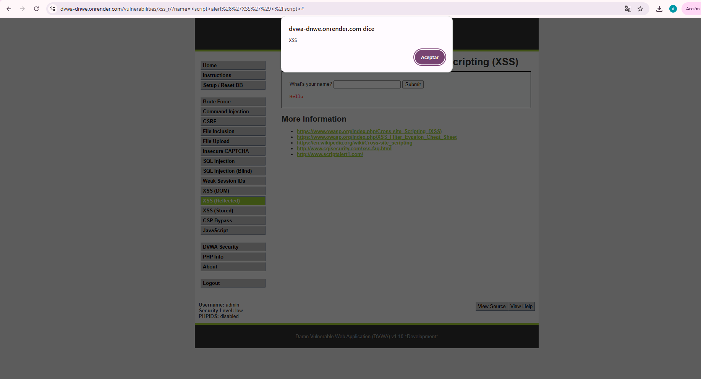

# XSS (Cross-Site Scripting) — Portal LogiCarga (notas de entrega)

## 1. Evidencia del ataque

**Dónde se ejecutó:** Módulo "XSS (Reflected)" de DVWA (curso TI3034), como entorno controlado equivalente al campo de "notas o comentarios de entrega" del portal de clientes de LogiCarga.

**Payload utilizado:** `<script>alert('XSS')</script>`

**Resultado obtenido:** Al enviar el payload, el navegador ejecutó el script inyectado, mostrando un cuadro de diálogo con el texto "XSS", confirmando que la entrada no fue sanitizada antes de insertarse en la página.




## 2. Por qué funciona esta vulnerabilidad

En el contexto de LogiCarga, el campo de "notas de entrega" permite que un usuario del portal (por ejemplo, un repartidor o un cliente) escriba un comentario que luego se muestra a otros usuarios autorizados de la misma cuenta corporativa (soporte, otros operadores). La aplicación toma esa entrada y la inserta directamente en el HTML de la página sin procesarla:

```html
<!-- Entrada normal -->
<p>Nota: Entrega coordinada para las 15:00 hrs</p>

<!-- Entrada maliciosa -->
<p>Nota: <script>alert('XSS')</script></p>
```

El navegador no distingue entre el texto que escribió el usuario y el código propio de la página: si la entrada contiene una etiqueta `<script>`, el navegador la **ejecuta** en lugar de mostrarla como texto. La causa raíz es la falta de separación entre datos y código en el momento de renderizar el contenido — la aplicación nunca "sanitiza" ni "escapa" lo que el usuario escribió antes de insertarlo en la página.

En un escenario real sobre LogiCarga, esto permitiría a un atacante robar la sesión de otro usuario del portal (por ejemplo, de un operador con más privilegios), redirigirlo a un sitio falso, o mostrarle un formulario fraudulento dentro del propio portal de confianza.

## 3. Clasificación CVSS 3.1

| Métrica | Valor |
|---|---|
| Vector de ataque (AV) | Network |
| Complejidad de ataque (AC) | Low |
| Privilegios requeridos (PR) | None |
| Interacción del usuario (UI) | Required |
| Confidencialidad (C) | Low |
| Integridad (I) | Low |
| Disponibilidad (A) | None |

**Puntaje CVSS 3.1:** 6.1 (Media) — Vector: `CVSS:3.1/AV:N/AC:L/PR:N/UI:R/S:C/C:L/I:L/A:N`
**Severidad estimada:** Media (requiere interacción de la víctima, pero compromete la confianza dentro de un portal corporativo usado por múltiples empresas).

## 4. Política de prevención (causa raíz)

**Escapar la salida:** todo contenido generado por el usuario (como las notas de entrega) debe convertirse a texto seguro antes de insertarse en el HTML — por ejemplo, transformando `<` en `&lt;` y `>` en `&gt;`, de modo que cualquier etiqueta escrita por el usuario se muestre como texto literal y nunca se ejecute como código.

```jsx
// Vulnerable (React con dangerouslySetInnerHTML)
<div dangerouslySetInnerHTML={{ __html: nota }} />

// Seguro (React escapa automáticamente el contenido por defecto)
<div>{nota}</div>
```

## 5. Control de mitigación

- **Política de seguridad de contenido (CSP):** configurar una cabecera Content-Security-Policy que restrinja qué scripts pueden ejecutarse en el portal, bloqueando la ejecución de scripts inyectados aunque alguno logre insertarse.
- **Validación de longitud y formato del campo de notas (referencia OWASP — A03:2021 Injection / Cheat Sheet de XSS Prevention):** limitar el campo de notas a texto plano, sin permitir etiquetas HTML, y aplicar las mismas reglas tanto en el frontend como en el backend (la validación solo en el navegador no es suficiente, ya que puede evadirse).

## 6. Relación con los activos de LogiCarga

Esta vulnerabilidad compromete principalmente la **confianza y la sesión de los usuarios del portal** (credenciales de acceso) y puede usarse como puerta de entrada para acceder, mediante el robo de sesión, al resto de los activos: historial de envíos, datos de facturación y datos de las empresas clientes.